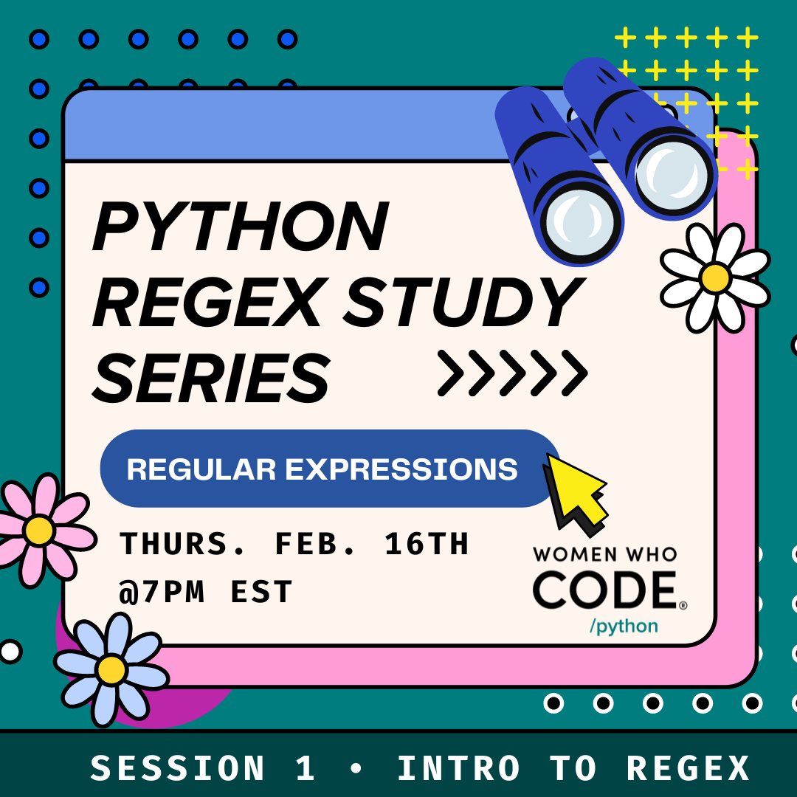

  

# <b>Women Who Code Python Presents: </b> __Regex Study Group__  

For beginners with fundamental Python knowledge, we will cover Basic RegEx Structure, introduction of Regular Expression and Language, Metacharacter, and RegEx methods in Python, fun RegEx games, and practice questions in this 5-part series.

# Study group materials  
Materials introduced during the session

__Session 1 - Introduction of Regular Expression__  
* [slides](/slides/Regex%20Workshop%20Series%20-%20Session%201.pdf)  

__Session 2 - Metacharacter I__  
* [slides](/slides/Regex%20Workshop%20Series%20-%20Session%202.pdf)  
* [python script example - phone number](/examples/ses2_regex_phone.py)   

__Session 3 - Metacharacter II (coming soon)__ 

# Resources / Useful Links  
List of useful links and reading materials to enhance your regex skill  
* [Regex101 - popular online website to test out your regex pattern](https://regex101.com/)  
* [Mastering Regular Expression (book)](https://www.oreilly.com/library/view/mastering-regular-expressions/0596528124/)

# Regex Fun Games:video_game:  
What's better than practicing your technical skills in playing games? 
* [Regex Crossword](https://regexcrossword.com/)  
* [Regex Golf](https://alf.nu/RegexGolf?world=regex&level=r00)  
